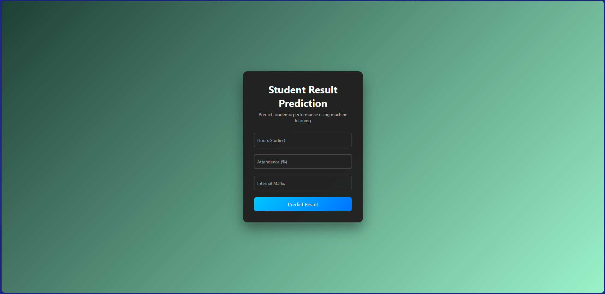

# Student Result Prediction using Machine Learning and AWS

This project predicts student final exam scores based on study hours,
attendance, and internal marks.

## Technologies Used
- Python
- Flask
- Scikit-learn
- AWS EC2

## Features
- Machine learning regression model
- Web-based interface
- Deployed on AWS EC2

## How to Run Locally
1. Install dependencies
2. Run app.py
3. Open browser at localhost:5000

## Deployment
The application is deployed on AWS EC2.

## Screenshots

